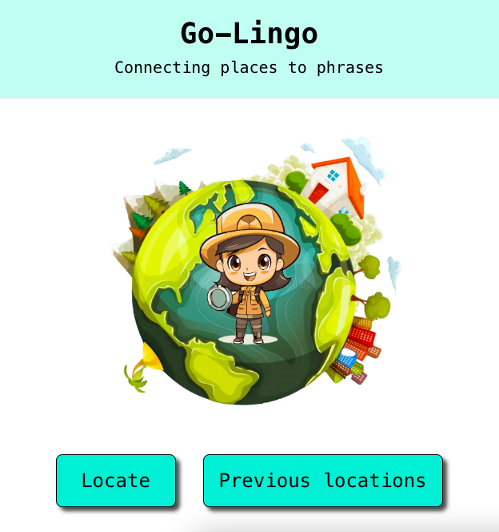
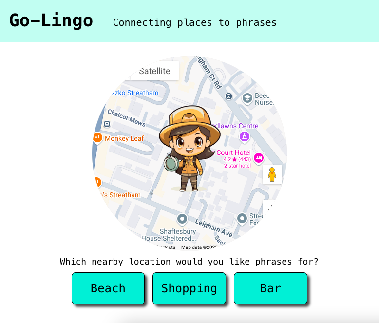

# Go-Lingo project

### Technologies used

- JavaScript
- React
- GoogleMaps API

The aim of Go-Lingo is to provide the user with relevant phrases based on their location, Eg. If they are at a coffee shop they will be given useful phrases on how to order a coffee.

1. Once you click **locate**, it will take your geolocation coordinates and set them in the Googlemaps API. Googlemaps is only used for visual effect to show where you are on the map, and not used in the logic.

2. We then call my backend API to fetch locations, and provide it with the geolocation coordinates too. It returns an array of location names that are within 100m radius. We present this as options on the front end of the user to choose.

3. Once the user has chosen a location, we will then call the backend again to fetch phrases based on the location name.

### To do
1. Create login pages and error messages

2. Update previous locations button into a dropdown

3. Add tests

4. Deploy project to production

5. Configure continuous integration

